# Run

Cari Runners blog reader mobile apps written in Flutter.

## Setup

### Android

Create a `android/app/fabric.properties` file and include your own Fabric `apiKey` and `apiSecret`.
Example:
```
apiKey=xxxxxxxxxxxxxxxxxxxxxxxxxxxxxxxxxxxxxxxx
apiSecret=xxxxxxxxxxxxxxxxxxxxxxxxxxxxxxxxxxxxxxxxxxxxxxxxxxxxxxxxxxxxxxxx
```

Create a `android/app/google-services.json` file to include your own Firebase.

Create a `android/cert/keystore.properties` file and include your own keystore storeFile, storePassword, keyAlias and keyPassword.
Example:
```
storeFile=../cert/keystore.jks
storePassword=xxxxxxxx
keyAlias=xxxxxxxx
keyPassword=xxxxxxxx
```

### iOS

Create a `ios/Runner/GoogleService-Info.plist` files to include your own Firebase.

## Screenshots

### Android

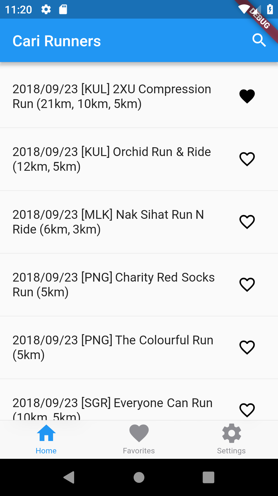
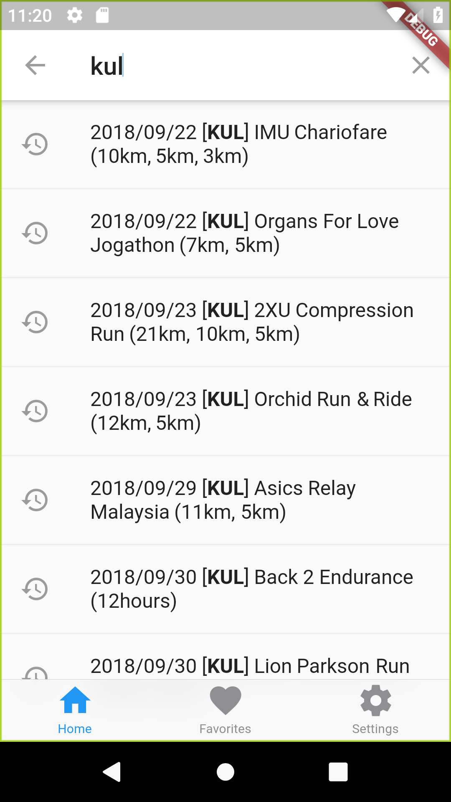
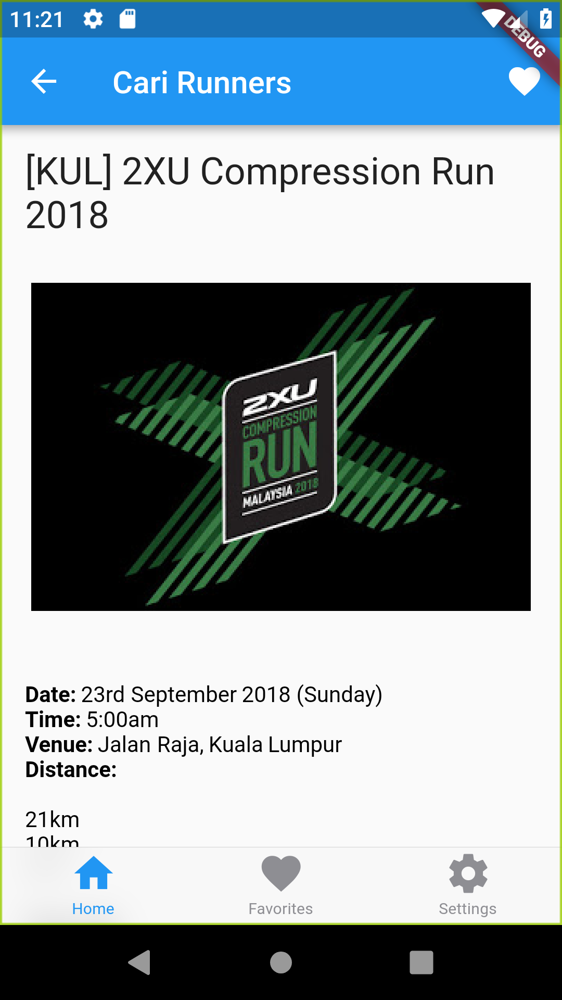
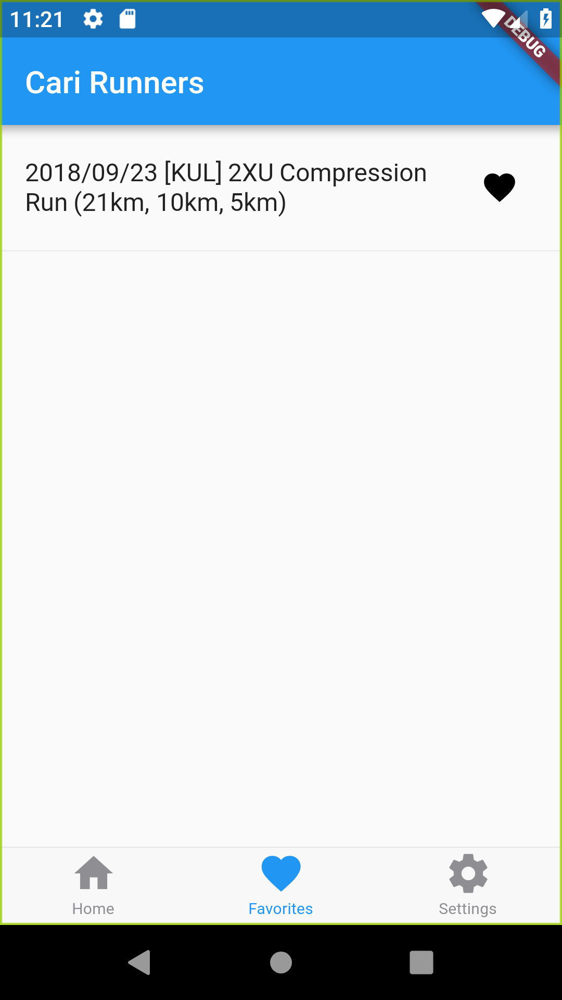
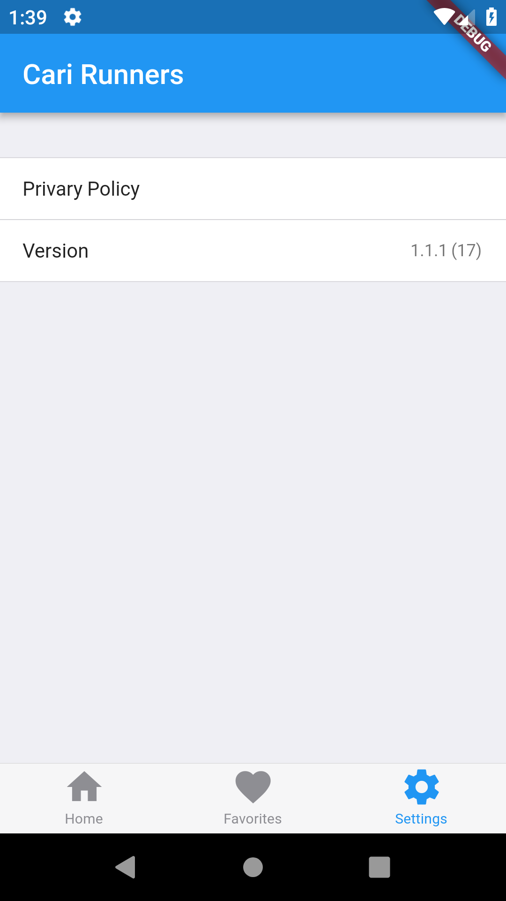
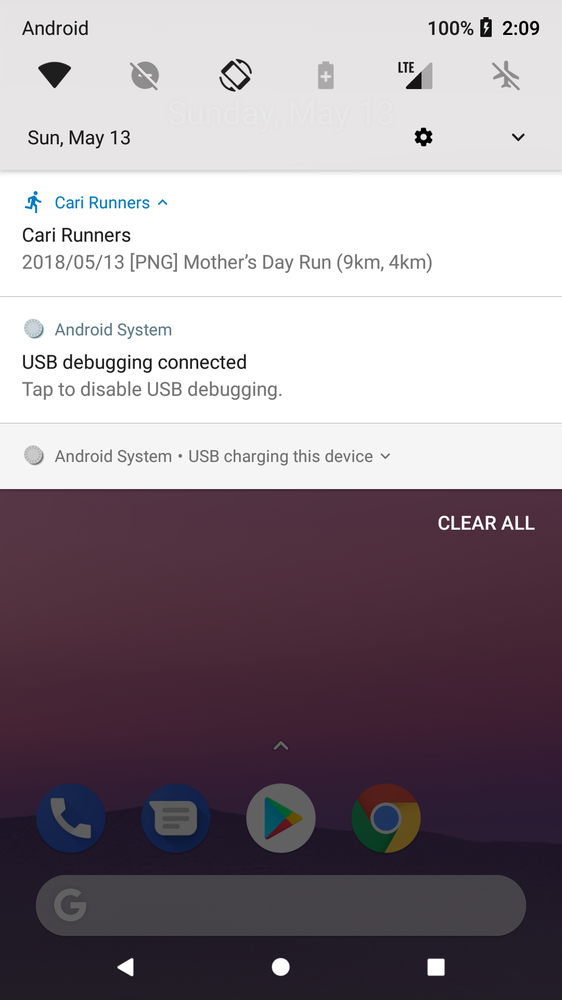

### iOS

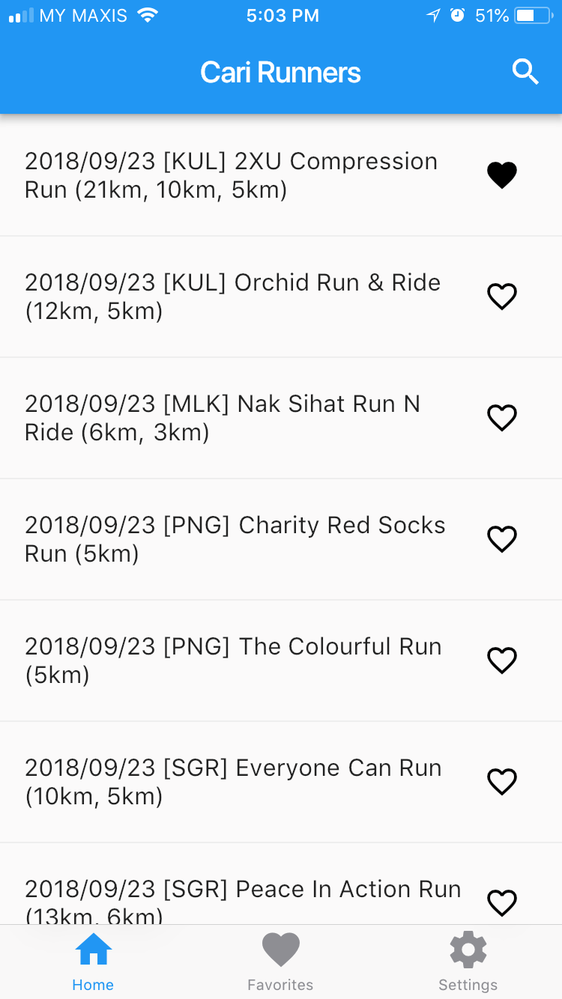
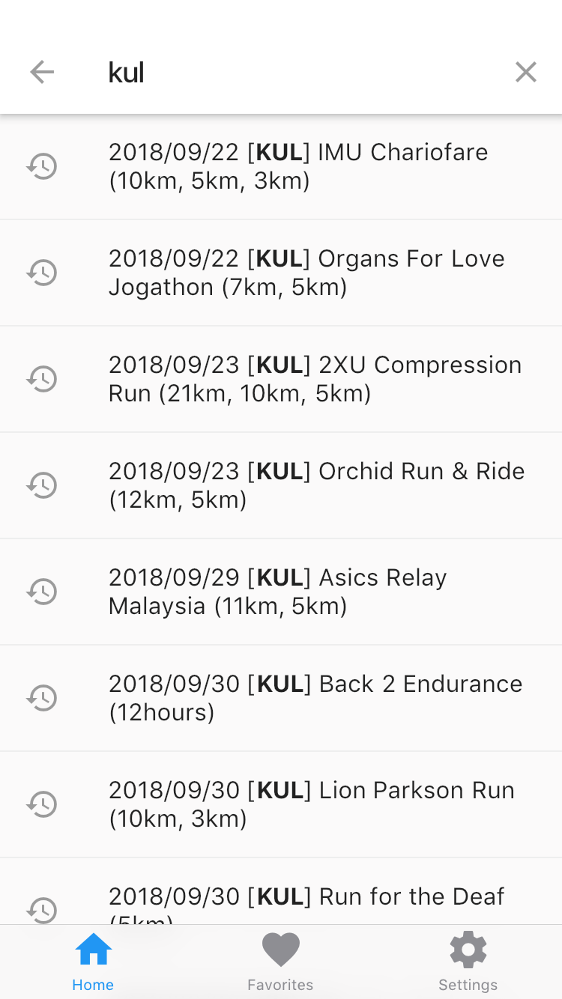

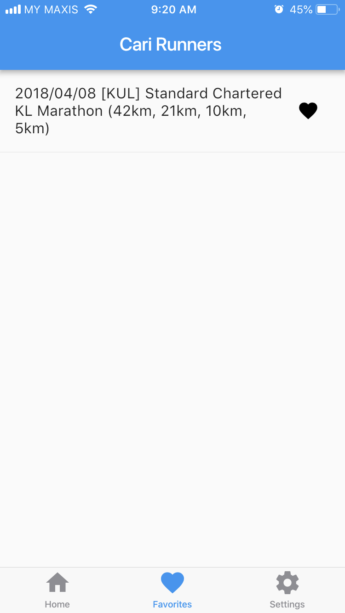
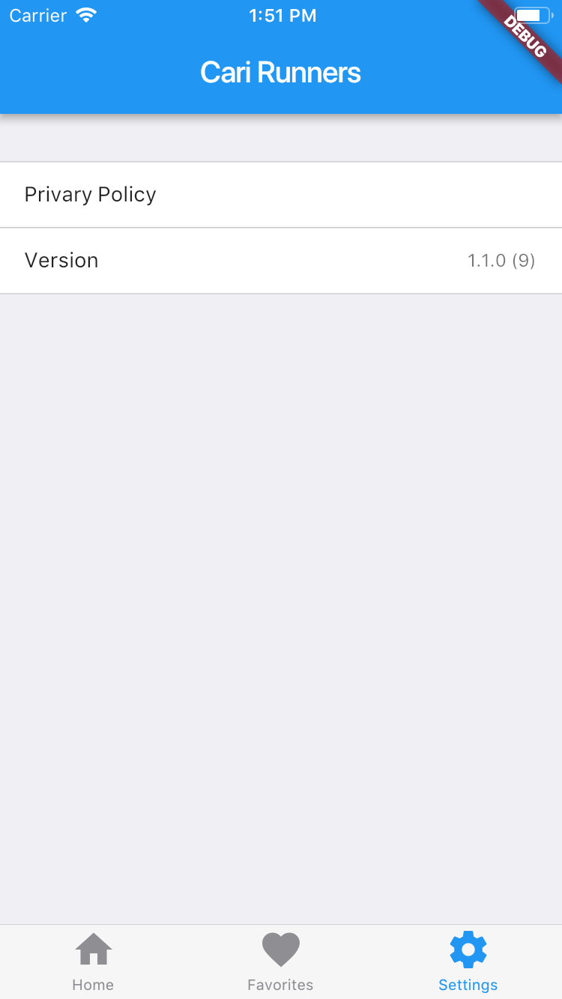
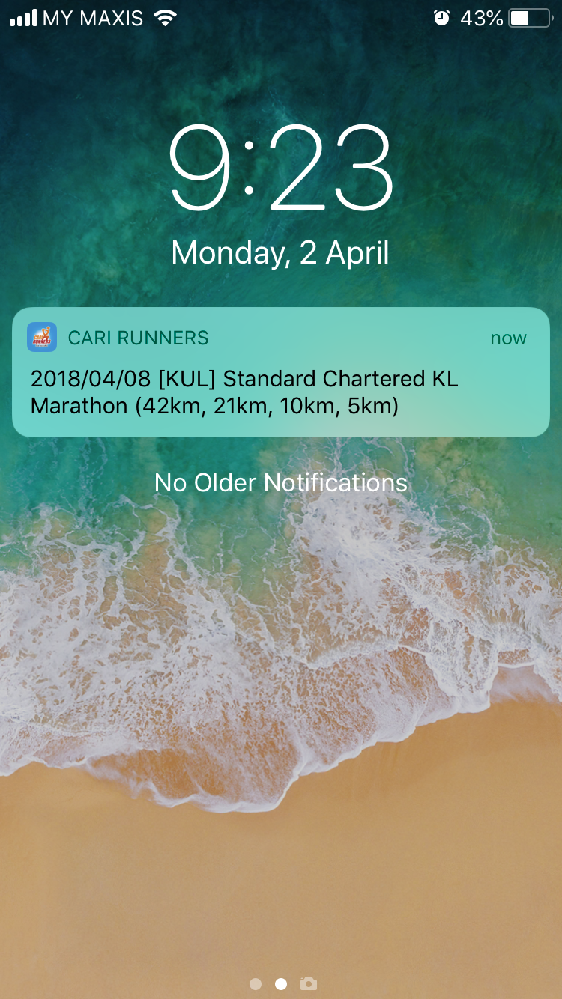
